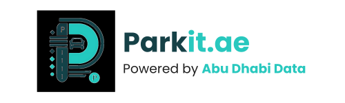

<link rel="stylesheet" href="styles.css">

  

<!-- English Content -->

<h1>Frequently Asked Questions</h1>

  <button class="faq-question">What is Parkit.ae?</button>
  

    
Parkit.ae is an AI-powered parking solution that revolutionizes urban parking in Abu Dhabi. The system allows drivers to seamlessly reserve parking spots, significantly reducing the time spent searching for parking.

  

  <button class="faq-question">What are the benefits of Parkit.ae, and what problems does it solve?</button>
  

    <ul>
      <li>Time Savings: Reduces parking search times from 15–20 minutes to under 60 seconds, saving approximately 3,500 hours daily for 10,000 users.</li>
      <li>User Convenience: Offers a seamless, AI-powered booking experience that makes reserving parking spots effortless and efficient, enhancing the overall user experience.</li>
      <li>Reduced Traffic Congestion: Decreases unnecessary driving while searching for parking, improving traffic flow in urban areas.</li>
      <li>Environmental Impact: Minimizes fuel consumption and carbon emissions, contributing to sustainability.</li>
    </ul>
  

  <button class="faq-question">What challenges might Parkit.ae face during implementation?</button>
  

    <ol>
      <li>Government Adoption: The zero-infrastructure approach relies heavily on the UAE government adopting Parkit.ae as the primary parking management software.</li>
      <li>Parking Spot Identification: For an efficient zero-infrastructure solution, parking spots must be marked with numbers to enable seamless identification and reservations.</li>
      <li>System Integration: Collaborating with existing entities like Mawaqif could involve technical challenges and the need to develop custom integrations.</li>
      <li>Camera Authorization: Using existing street cameras for parking detection requires proper authorization from relevant authorities to access and utilize the camera feeds.</li>
      <li>Hardware Costs: Deploying IoT-enabled sensors for real-time parking data involves higher initial costs and scaling challenges.</li>
    </ol>
    
These challenges will vary depending on the implementation path chosen, as each approach may require different resources and approvals.

  

  <button class="faq-question">What guarantees do I have that the parking spot I reserve will be free when I reach the parking location?</button>
  

    
Parkit.ae ensures reserved spots are available through real-time tracking and regular patrols, similar to Mawaqif. If a spot is taken by an unauthorized vehicle, users will be able to report the issue through our support page. The nearest employee on patrol will respond quickly to resolve the situation. This feature is currently being considered and is yet to be implemented, but it will provide additional assurance that your reserved spot will be available when you arrive.

  

  <button class="faq-question">How does Parkit.ae ensure scalability?</button>
  

    
Parkit.ae is designed with scalability in mind, allowing it to adapt to changing requirements and growth:

    <ul>
      <li>Modular Design: The system is highly flexible and can be easily modified to meet the specific needs of different areas, ensuring seamless scalability.</li>
      <li>Zero-Infrastructure Model: With minimal physical implementation, Parkit.ae remains cost-effective and adaptable across various urban environments.</li>
      <li>Flexible Hardware Integration: Optional components like cameras or IoT sensors can be integrated and expanded in high-demand areas as needed, allowing the system to grow efficiently.</li>
    </ul>
  

  <button class="faq-question">What steps are necessary to bring Parkit.ae to market?</button>
  

    
To bring Parkit.ae to market, we will begin with a pilot test in the Department of Government Enablement (DGE) parking area. DGE employees will use the system to provide valuable feedback. Based on this data, we will refine the system and make necessary adjustments. Once successful, Parkit.ae will be scaled for wider implementation across Abu Dhabi and beyond.

  

Discover the future of urban parking at <a href="https://parkit-ae.vercel.app" target="_blank" rel="noopener noreferrer">parkit-ae.vercel.app</a>

<!-- Arabic Content -->

<h1>الأسئلة المتكررة</h1>

  <button class="faq-question">ما هو Parkit.ae؟</button>
  

    
Parkit.ae هو حل ذكي للمواقف مدعوم بالذكاء الاصطناعي يعمل على تطوير تجربة ركن السيارات في أبوظبي. يتيح النظام للسائقين حجز مواقف السيارات بسلاسة، مما يقلل بشكل كبير من الوقت المستغرق في البحث عن موقف.

  

  <button class="faq-question">ما هي فوائد Parkit.ae، وما المشكلات التي يحلها؟</button>
  

    <ul>
      <li>توفير الوقت: يقلل وقت البحث عن موقف من 15-20 دقيقة إلى أقل من 60 ثانية، مما يوفر حوالي 3,500 ساعة يومياً لـ 10,000 مستخدم.</li>
      <li>راحة المستخدم: يقدم تجربة حجز سلسة مدعومة بالذكاء الاصطناعي تجعل حجز مواقف السيارات سهلاً وفعالاً، مما يحسن تجربة المستخدم الشاملة.</li>
      <li>تقليل الازدحام المروري: يقلل من القيادة غير الضرورية أثناء البحث عن موقف، مما يحسن حركة المرور في المناطق الحضرية.</li>
      <li>التأثير البيئي: يقلل من استهلاك الوقود وانبعاثات الكربون، مما يساهم في الاستدامة.</li>
    </ul>
  

  <button class="faq-question">ما هي التحديات التي قد يواجهها Parkit.ae خلال التنفيذ؟</button>
  

    <ol>
      <li>تبني الحكومة: يعتمد نهج البنية التحتية الصفرية بشكل كبير على تبني حكومة الإمارات لـ Parkit.ae كبرنامج إدارة المواقف الرئيسي.</li>
      <li>تحديد مواقف السيارات: للحصول على حل فعال بدون بنية تحتية، يجب ترقيم مواقف السيارات لتمكين التحديد والحجز السلس.</li>
      <li>تكامل النظام: قد يتضمن التعاون مع الكيانات القائمة مثل مواقف تحديات تقنية والحاجة إلى تطوير تكاملات مخصصة.</li>
      <li>تصريح الكاميرات: يتطلب استخدام كاميرات الشوارع الحالية لاكتشاف المواقف تصريحاً مناسباً من السلطات المعنية للوصول إلى تغذية الكاميرات واستخدامها.</li>
      <li>تكاليف الأجهزة: يتضمن نشر أجهزة استشعار متصلة بإنترنت الأشياء لبيانات المواقف في الوقت الفعلي تكاليف أولية أعلى وتحديات في التوسع.</li>
    </ol>
    
ستختلف هذه التحديات حسب مسار التنفيذ المختار، حيث قد يتطلب كل نهج موارد وموافقات مختلفة.

  

  <button class="faq-question">ما هي الضمانات التي لدي بأن موقف السيارة الذي أحجزه سيكون متاحاً عند وصولي إلى موقع المواقف؟</button>
  

    
يضمن Parkit.ae توفر المواقف المحجوزة من خلال التتبع في الوقت الفعلي والدوريات المنتظمة، مشابهاً لنظام مواقف. إذا تم شغل الموقف من قبل مركبة غير مصرح لها، سيتمكن المستخدمون من الإبلاغ عن المشكلة من خلال صفحة الدعم لدينا. سيستجيب أقرب موظف في الدورية بسرعة لحل الموقف. هذه الميزة قيد الدراسة حالياً ولم يتم تنفيذها بعد، ولكنها ستوفر ضماناً إضافياً بأن موقفك المحجوز سيكون متاحاً عند وصولك.

  

  <button class="faq-question">كيف يضمن Parkit.ae قابلية التوسع؟</button>
  

    
تم تصميم Parkit.ae مع مراعاة قابلية التوسع، مما يتيح له التكيف مع المتطلبات المتغيرة والنمو:

    <ul>
      <li>تصميم معياري: النظام مرن للغاية ويمكن تعديله بسهولة لتلبية الاحتياجات المحددة للمناطق المختلفة، مما يضمن قابلية التوسع السلس.</li>
      <li>نموذج بدون بنية تحتية: مع الحد الأدنى من التنفيذ المادي، يظل Parkit.ae فعالاً من حيث التكلفة وقابلاً للتكيف عبر البيئات الحضرية المختلفة.</li>
      <li>تكامل مرن للأجهزة: يمكن دمج المكونات الاختيارية مثل الكاميرات أو أجهزة استشعار إنترنت الأشياء وتوسيعها في المناطق ذات الطلب المرتفع حسب الحاجة، مما يتيح للنظام النمو بكفاءة.</li>
    </ul>
  

  <button class="faq-question">ما هي الخطوات اللازمة لطرح Parkit.ae في السوق؟</button>
  

    
لطرح Parkit.ae في السوق، سنبدأ باختبار تجريبي في منطقة مواقف دائرة الإسناد الحكومي (DGE). سيستخدم موظفو DGE النظام لتقديم ملاحظات قيمة. بناءً على هذه البيانات، سنقوم بتحسين النظام وإجراء التعديلات اللازمة. بمجرد نجاح التجربة، سيتم توسيع نطاق Parkit.ae للتنفيذ على نطاق أوسع في جميع أنحاء أبوظبي وما بعدها.

  

اكتشف مستقبل مواقف السيارات في المدن على <a href="https://parkit-ae.vercel.app" target="_blank" rel="noopener noreferrer">parkit-ae.vercel.app</a>

